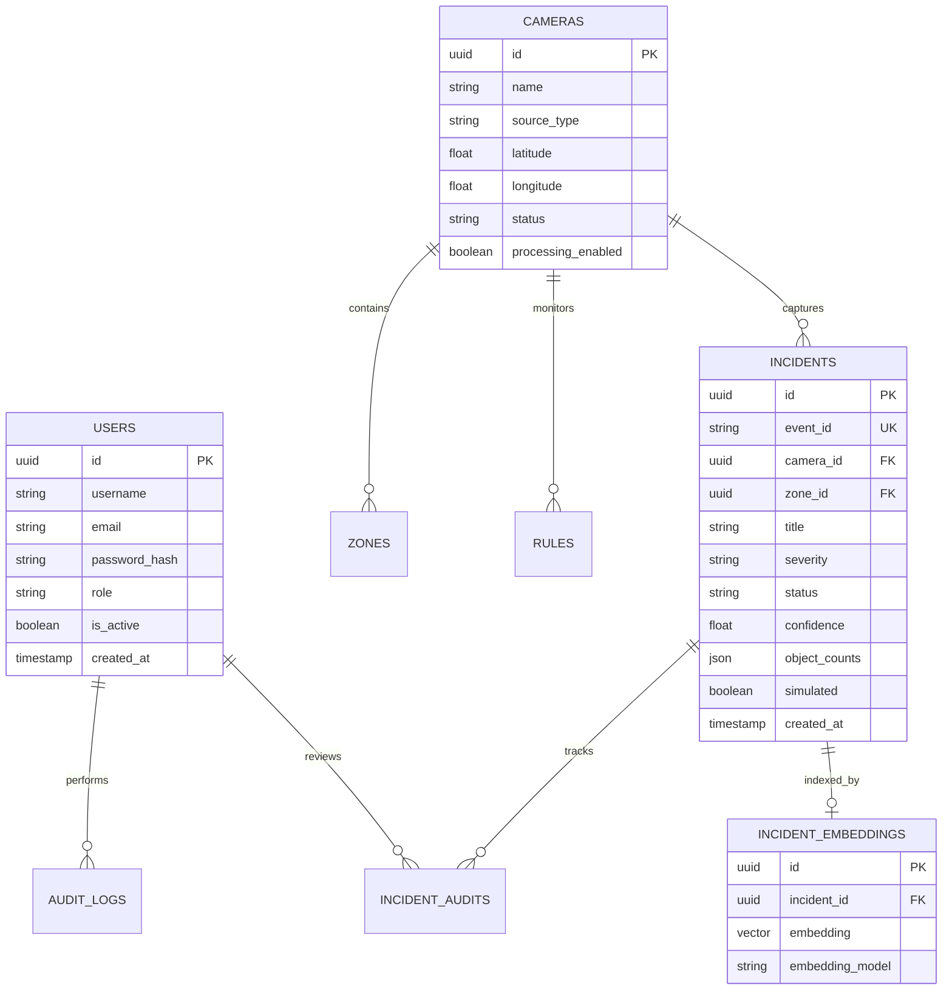

# SentinelEdge Database Schema

```mermaid
erDiagram
    USERS ||--o{ AUDIT_LOGS : performs
    USERS ||--o{ INCIDENT_AUDITS : reviews
    CAMERAS ||--o{ ZONES : contains
    CAMERAS ||--o{ RULES : monitors
    CAMERAS ||--o{ INCIDENTS : captures
    INCIDENTS ||--o{ INCIDENT_AUDITS : tracks
    INCIDENTS ||--o| INCIDENT_EMBEDDINGS : indexed_by

    USERS {
        uuid id PK
        string username
        string email
        string password_hash
        string role
        boolean is_active
        timestamp created_at
    }

    CAMERAS {
        uuid id PK
        string name
        string source_type
        float latitude
        float longitude
        string status
        boolean processing_enabled
    }

    INCIDENTS {
        uuid id PK
        string event_id UK
        uuid camera_id FK
        uuid zone_id FK
        string title
        string severity
        string status
        float confidence
        json object_counts
        boolean simulated
        timestamp created_at
    }

    INCIDENT_EMBEDDINGS {
        uuid id PK
        uuid incident_id FK
        vector embedding
        string embedding_model
    }
```
